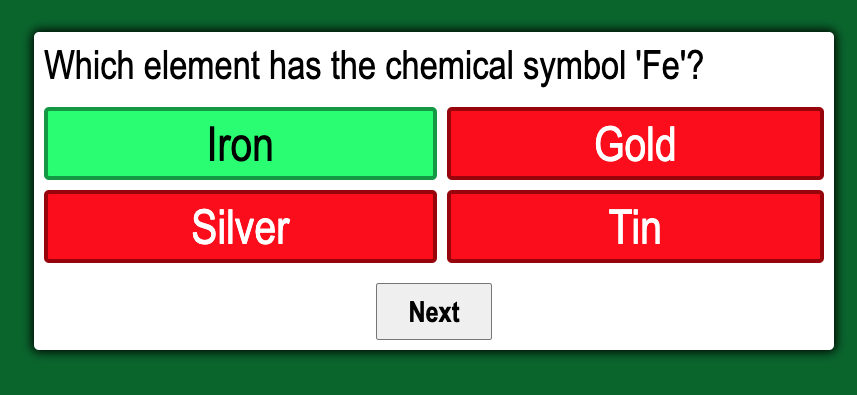
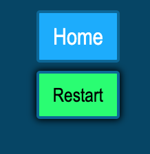

# My Curious Nature Quiz Game
This is a fun little trivia quiz game about science and nature! It allows the player to login  with a username and answer a series of questions as it keeps your score. Come test your knowledge about the world!

# How it works
Once you log into the game, you will be supplied with a series of questions being pulled from an external trivia API. 

# Technologies
- I used HTML, CSS, and Javascript to create this application.
- Trivia questions API from [Open Trivia Database API](https://opentdb.com/api_config.php)
 
# Login Page
Type in your name and press Enter. You will then be taken to the game.

# Start Game
Press the start button and begin the game.

# Questions
Read the questions and click the answer you believe is correct. If it is correct, you will be awarded a point. Then you will be prompted to go to the next question.

# End of Game
When you have answered all 5 questions, a "RESTART" button will appear. If you click it, then you will restart the game as the same username you typed in. If you click the "HOME" button, it will take you to the login page.

# Play the Game

<a href="https://mycuriousnature.netlify.app/login.html" target="_blank">`    My Curious Nature Quiz Game  `</a>
